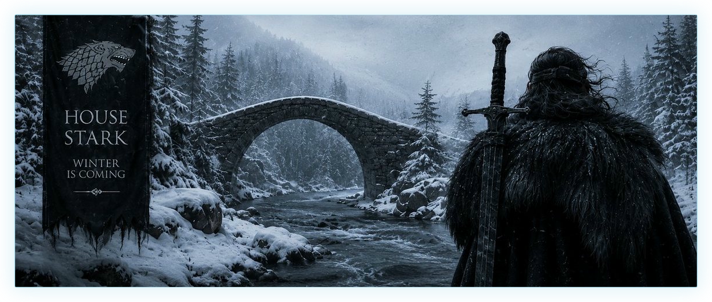
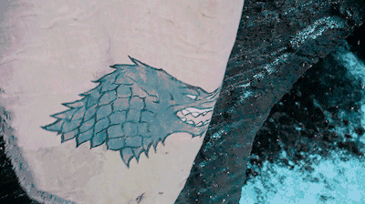
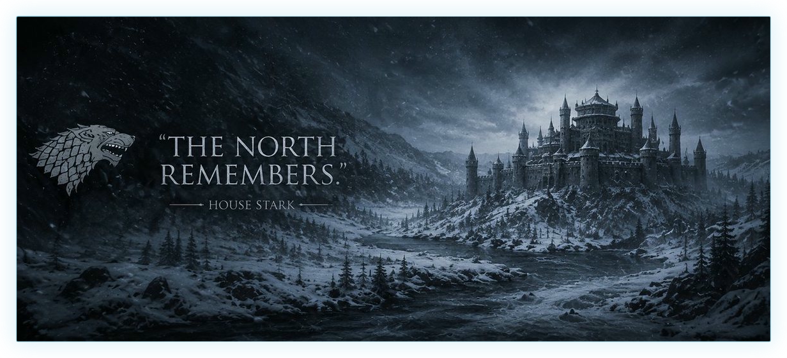

  

  <picture>
    <source media="(prefers-color-scheme: dark)"  srcset=".github/assets/name-dark.svg">
    <source media="(prefers-color-scheme: light)" srcset=".github/assets/name-light.svg">
    
  </picture>

  <picture>
    <source media="(prefers-color-scheme: dark)"  srcset=".github/assets/title-dark.svg">
    <source media="(prefers-color-scheme: light)" srcset=".github/assets/title-light.svg">
    
  </picture>

  <picture>
    <source media="(prefers-color-scheme: dark)"  srcset=".github/assets/meta-dark.svg">
    <source media="(prefers-color-scheme: light)" srcset=".github/assets/meta-light.svg">
    
  </picture>

 

  <picture>
    <source media="(prefers-color-scheme: dark)"  srcset=".github/assets/sec-about-me-dark.svg">
    <source media="(prefers-color-scheme: light)" srcset=".github/assets/sec-about-me-light.svg">
    
  </picture>

<table>
<tr>
<td width="62%" valign="middle">

  <picture>
    <source media="(prefers-color-scheme: dark)"  srcset=".github/assets/about-dark.svg">
    <source media="(prefers-color-scheme: light)" srcset=".github/assets/about-light.svg">
    
  </picture>

</td>
<td width="38%" valign="middle">

</td>
</tr>
</table>

 

  <picture>
    <source media="(prefers-color-scheme: dark)"  srcset=".github/assets/sec-core-skills-dark.svg">
    <source media="(prefers-color-scheme: light)" srcset=".github/assets/sec-core-skills-light.svg">
    
  </picture>

  
  
  
  
  

  
  
  
  
  

 

  <picture>
    <source media="(prefers-color-scheme: dark)"  srcset=".github/assets/sec-portfolio-dark.svg">
    <source media="(prefers-color-scheme: light)" srcset=".github/assets/sec-portfolio-light.svg">
    
  </picture>

<i>reservado — fase 2</i>

  

  <picture>
    <source media="(prefers-color-scheme: dark)"  srcset=".github/assets/sec-production-work-dark.svg">
    <source media="(prefers-color-scheme: light)" srcset=".github/assets/sec-production-work-light.svg">
    
  </picture>

<i>reservado — fase 2</i>

  

  <picture>
    <source media="(prefers-color-scheme: dark)"  srcset=".github/assets/sec-contact-dark.svg">
    <source media="(prefers-color-scheme: light)" srcset=".github/assets/sec-contact-light.svg">
    
  </picture>

<i>reservado — fase 2</i>

 

  

