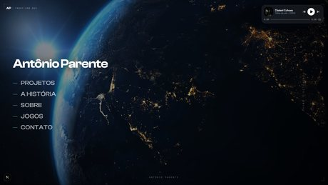
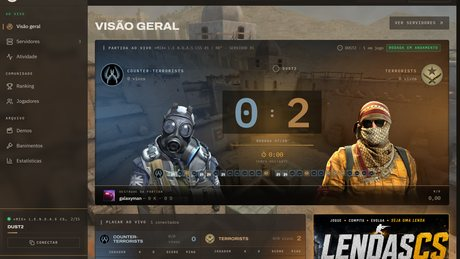
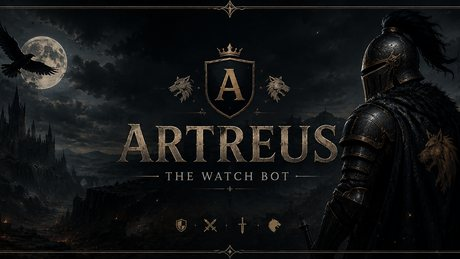
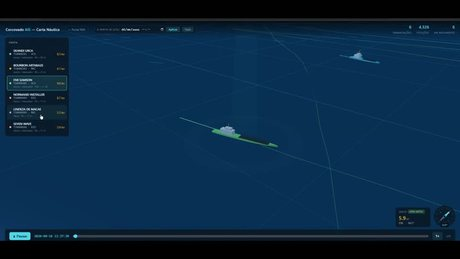
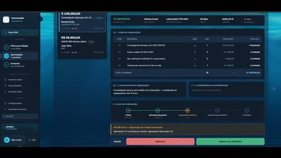
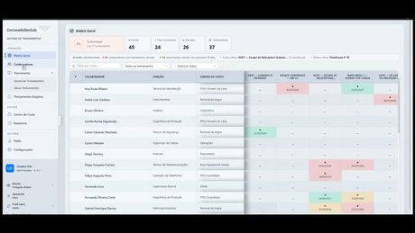
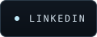
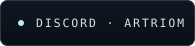
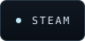

  

  <picture>
    <source media="(prefers-color-scheme: dark)"  srcset=".github/assets/name-dark.svg">
    <source media="(prefers-color-scheme: light)" srcset=".github/assets/name-light.svg">
    
  </picture>

  <picture>
    <source media="(prefers-color-scheme: dark)"  srcset=".github/assets/title-dark.svg">
    <source media="(prefers-color-scheme: light)" srcset=".github/assets/title-light.svg">
    
  </picture>

  <picture>
    <source media="(prefers-color-scheme: dark)"  srcset=".github/assets/meta-dark.svg">
    <source media="(prefers-color-scheme: light)" srcset=".github/assets/meta-light.svg">
    
  </picture>

 

  <picture>
    <source media="(prefers-color-scheme: dark)"  srcset=".github/assets/sec-about-me-dark.svg">
    <source media="(prefers-color-scheme: light)" srcset=".github/assets/sec-about-me-light.svg">
    
  </picture>

<table>
<tr>
<td width="72%" valign="middle">

  <picture>
    <source media="(prefers-color-scheme: dark)"  srcset=".github/assets/about-dark.svg">
    <source media="(prefers-color-scheme: light)" srcset=".github/assets/about-light.svg">
    
  </picture>

</td>
<td width="28%" valign="middle">

</td>
</tr>
</table>

 

  <picture>
    <source media="(prefers-color-scheme: dark)"  srcset=".github/assets/sec-core-skills-dark.svg">
    <source media="(prefers-color-scheme: light)" srcset=".github/assets/sec-core-skills-light.svg">
    
  </picture>

  <picture>
    <source media="(prefers-color-scheme: dark)"  srcset=".github/assets/skills-dark.svg">
    <source media="(prefers-color-scheme: light)" srcset=".github/assets/skills-light.svg">
    
  </picture>

 

  <picture>
    <source media="(prefers-color-scheme: dark)"  srcset=".github/assets/sec-portfolio-dark.svg">
    <source media="(prefers-color-scheme: light)" srcset=".github/assets/sec-portfolio-light.svg">
    
  </picture>

<table>
<tr>
<td width="38%">
  
</td>
<td width="62%">
  <b><a href="https://github.com/AntonioPPereira/PereiraWorlds">Pereira Worlds</a></b> — meu site pessoal
  
Sem scroll: uma pilha de camadas fixas sobre quatro cenas em 4K que nunca cortam para preto. Dentro dele, dois jogos com engine escrita do zero — timestep fixo, colisão própria e frame data de verdade.

  <code>TypeScript</code> <code>Next.js</code> <code>Three.js</code> <code>GSAP</code> <code>Canvas 2D</code>
</td>
</tr>

<tr>
<td width="38%">
  
</td>
<td width="62%">
  <b><a href="https://lendas-servers.vercel.app">LENDAS Network</a></b> — rede de servidores Counter-Strike: Source &nbsp;·&nbsp; <a href="https://github.com/AntonioPPereira/Lendas-Servers">código</a>
  
Placar ao vivo por SSE, ranking, catálogo de demos e banimentos. Os dados saem de dois plugins em SourcePawn que rodam dentro do servidor de jogo — nada de mock atrás de uma API bonita.

  <code>TypeScript</code> <code>React</code> <code>Express</code> <code>SourcePawn</code> <code>SSE</code> <code>SFTP</code>
</td>
</tr>

<tr>
<td width="38%">
  
</td>
<td width="62%">
  <b><a href="https://github.com/AntonioPPereira/Artreus">Artreus</a></b> — bot de Discord
  
Utilidades, player de música e IA da Anthropic num só bot.

  <code>Node.js</code> <code>discord.js</code> <code>discord-player</code> <code>Claude</code>
</td>
</tr>
</table>

 

  <picture>
    <source media="(prefers-color-scheme: dark)"  srcset=".github/assets/sec-production-work-dark.svg">
    <source media="(prefers-color-scheme: light)" srcset=".github/assets/sec-production-work-light.svg">
    
  </picture>

<table>
<tr>
<td width="38%">
  
</td>
<td width="62%">
  <b>AIS Web</b> — entrega de dados AIS para a Petrobras &nbsp;·&nbsp; repositório privado
  
XML no formato exato do Apêndice D — coordenadas com Decimal e ROUND_HALF_UP em vez de float, heading 511 quando indisponível, calado em decímetros. Paginação por ID incremental; data malformada devolve 400, nunca a série inteira. Sobre a mesma base, uma carta náutica 3D onde cada casco é gerado por código a partir das dimensões reais do navio.

  <code>Python</code> <code>Flask</code> <code>PostgreSQL</code> <code>Three.js</code> <code>Docker</code> <code>Traefik</code>
</td>
</tr>

<tr>
<td width="38%">
  
</td>
<td width="62%">
  <b>Suprimentos</b> — fluxo de compras da operação &nbsp;·&nbsp; repositório privado
  
Requisição, aprovação em níveis e ordem de compra num fluxo só (PRC → LV1/LV2 → POC), com acesso definido pelos grupos do Azure AD e histórico completo de quem pediu, aprovou e comprou.

  <code>React</code> <code>FastAPI</code> <code>PostgreSQL</code> <code>Azure AD</code> <code>Docker</code> <code>Nginx</code>
</td>
</tr>

<tr>
<td width="38%">
  
</td>
<td width="62%">
  <b>Treinamentos</b> — conformidade de certificações offshore &nbsp;·&nbsp; repositório privado
  
Matriz colaborador × treinamento cruzando o que cada função exige com o que cada um tem — CBSP, NR-33, HUET, SSTA — sinalizando em dia, a vencer e vencido por centro de custo.

  <code>JavaScript</code> <code>Front-end</code>
</td>
</tr>
</table>

  

  <picture>
    <source media="(prefers-color-scheme: dark)"  srcset=".github/assets/sec-contact-dark.svg">
    <source media="(prefers-color-scheme: light)" srcset=".github/assets/sec-contact-light.svg">
    
  </picture>

  <a href="https://www.linkedin.com/in/antonio-parente-699647231/"><picture><source media="(prefers-color-scheme: dark)"  srcset=".github/assets/ct-linkedin-dark.svg"><source media="(prefers-color-scheme: light)" srcset=".github/assets/ct-linkedin-light.svg"></picture></a>
  <a href="mailto:antonioparentepereira@gmail.com"><picture><source media="(prefers-color-scheme: dark)"  srcset=".github/assets/ct-email-dark.svg"><source media="(prefers-color-scheme: light)" srcset=".github/assets/ct-email-light.svg"></picture></a>
  <a href="https://github.com/AntonioPPereira"><picture><source media="(prefers-color-scheme: dark)"  srcset=".github/assets/ct-github-dark.svg"><source media="(prefers-color-scheme: light)" srcset=".github/assets/ct-github-light.svg"></picture></a>
  <picture><source media="(prefers-color-scheme: dark)"  srcset=".github/assets/ct-discord-dark.svg"><source media="(prefers-color-scheme: light)" srcset=".github/assets/ct-discord-light.svg"></picture>
  <a href="https://steamcommunity.com/id/Artriom/"><picture><source media="(prefers-color-scheme: dark)"  srcset=".github/assets/ct-steam-dark.svg"><source media="(prefers-color-scheme: light)" srcset=".github/assets/ct-steam-light.svg"></picture></a>

 

  

