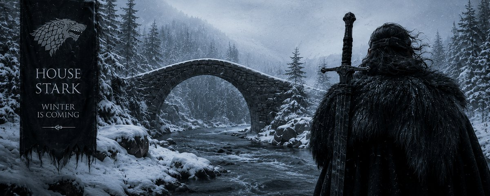
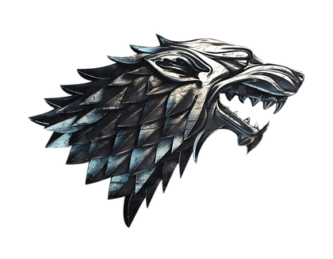

  

<h2 align="center">ANTONIO &nbsp;"KAI"&nbsp; PARENTE</h2>

  

  Rio de Janeiro, Brazil &nbsp;·&nbsp; Português &amp; English

 

<h3>
  
  &nbsp;ABOUT ME
</h3>

<table>
<tr>
<td width="70%" valign="middle">

</td>
<td width="30%" valign="middle">

</td>
</tr>
</table>

 

<h3>// CORE SKILLS</h3>

  
  
  
  
  

  
  
  
  
  

 

<h3>
  
  &nbsp;PORTFOLIO
</h3>

<i>reservado — fase 2</i>

  

<h3>
  
  &nbsp;PRODUCTION WORK
</h3>

<i>reservado — fase 2</i>

  

<h3>
  
  &nbsp;CONTACT
</h3>

<i>reservado — fase 2</i>
