  

<h3 align="center">ANTONIO &nbsp;"KAI"&nbsp; PARENTE</h3>

  

  Rio de Janeiro, Brazil &nbsp;·&nbsp; Português &amp; English

  <b>Interfaces que encantam, sistemas que sustentam.</b>

 

  

<i>reservado — portfólio</i>

 

  

<i>reservado — sistemas em produção</i>

 

  

  
  
  
  

  
  
  
  

 

  

<i>reservado — contato</i>

